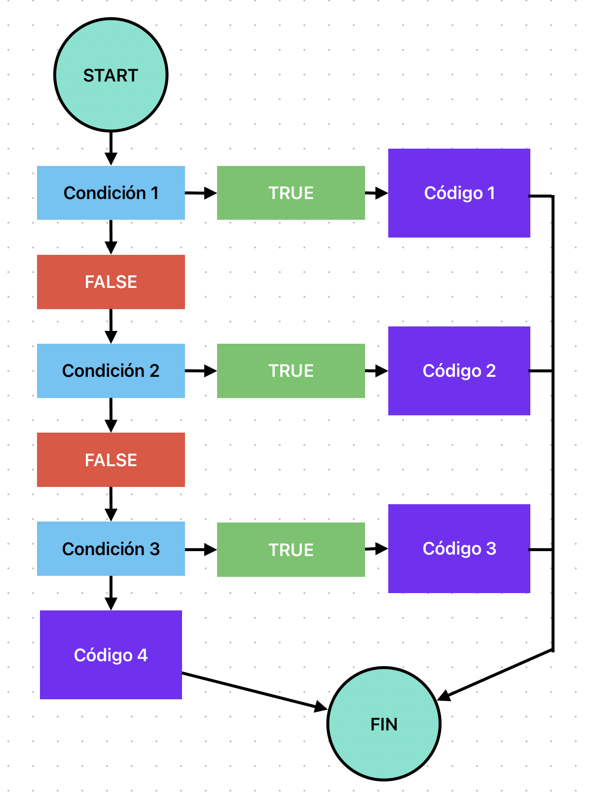
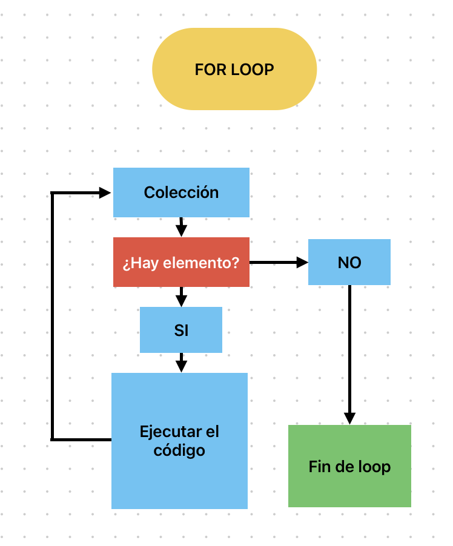
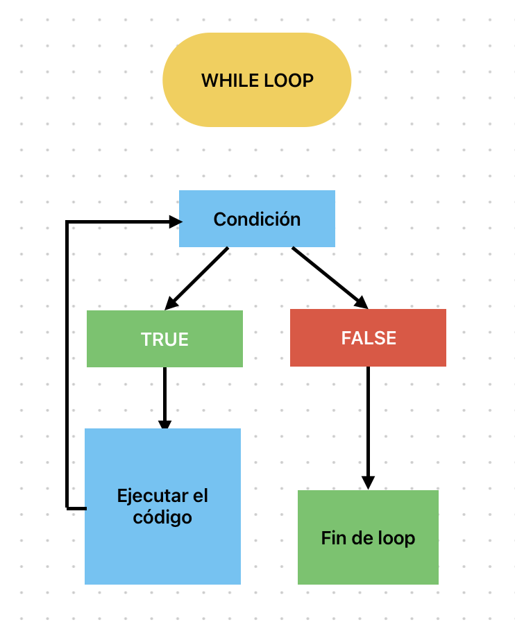

# Documentacion para nuevos desarolles

## ¿Qué es un condicional en Python?

Una **condición** en Python es una estructura fundamental que permite que el programa tome decisiones y ejecute diferentes bloques de código según si una expresión es verdadera (`True`) o falsa (`False`). Esto se logra mediante las sentencias de control de flujo: `if`, `elif` y `else`.

### Introducción y contexto

En la vida cotidiana, constantemente tomamos decisiones basadas en condiciones: "Si está lloviendo, llevo paraguas; si no, salgo sin él". De la misma manera, los programas necesitan tomar decisiones para adaptarse a diferentes situaciones. Los condicionales son la herramienta que permite a los lenguajes de programación, como Python, simular este tipo de razonamiento lógico.

### Breve historia

El uso de condicionales en programación se remonta a los primeros lenguajes de alto nivel, como Fortran y BASIC. Python, al igual que otros lenguajes modernos, utiliza una sintaxis clara y sencilla para expresar condiciones, lo que facilita el aprendizaje para principiantes.

> **¿Por qué son importantes?**
>
> Permiten que el programa responda de manera diferente según la situación, haciendo que tu código sea dinámico e interactivo. Sin condicionales, todos los programas seguirían siempre el mismo camino, sin adaptarse a los datos o a las necesidades del usuario.

### Lógica booleana

Las condiciones se basan en la **lógica booleana**, que solo puede tener dos valores: `True` (verdadero) o `False` (falso). En Python, cualquier expresión que se pueda evaluar como verdadera o falsa puede ser usada en un condicional.

Ejemplo de expresiones booleanas:

```python
5 > 3      # True
2 == 4     # False
nombre != "Ana"  # True si nombre no es "Ana"
```

### ¿Cómo funciona un condicional?

Cuando el programa encuentra una sentencia `if`, evalúa la condición:

- Si la condición es verdadera (`True`), ejecuta el bloque de código indentado debajo del `if`.
- Si es falsa (`False`), pasa al siguiente `elif` (si existe) o al bloque `else`.

### ¿Qué se puede poner como condición?

No solo comparaciones. También puedes usar variables, funciones que devuelvan booleanos, o incluso valores numéricos (donde 0 es considerado `False` y cualquier otro número es `True`).

```python
activo = 1
if activo:
	print("El usuario está activo")
```

### Operadores de comparación

Los condicionales suelen utilizar operadores de comparación para evaluar expresiones. Los más comunes son:

| Operador | Significado       | Ejemplo  |
| -------- | ----------------- | -------- |
| `==`     | igual a           | `a == b` |
| `!=`     | no igual a        | `a != b` |
| `>`      | mayor que         | `a > b`  |
| `<`      | menor que         | `a < b`  |
| `>=`     | mayor o igual que | `a >= b` |
| `<=`     | menor o igual que | `a <= b` |

### Estructura básica de un condicional

```python
if condicion:
	# Bloque de código si la condición es verdadera
elif otra_condicion:
	# Bloque de código si la otra condición es verdadera
else:
	# Bloque de código si ninguna condición anterior es verdadera
```

> **Nota:** La indentación es obligatoria en Python. Un error común es olvidar los espacios o mezclar espacios y tabulaciones.

### Diagrama de flujo de un condicional



### Ejemplo 1: Solo `if`

Condición en lenguaje natural: **_Si tu edad es mayor o igual a 18, puedes acceder a una discoteca_**

```python
edad = 18
if edad >= 18:
	print("Eres mayor de edad")
```

**¿Qué sucede aquí?**
El programa evalúa si la variable `edad` es mayor o igual a 18. Si es cierto, imprime el mensaje. Si no, no hace nada.

**Salida esperada:**

```
Eres mayor de edad
```

### Ejemplo 2: `if` y `else`

Condición: **_Si tu edad es mayor o igual a 18, puedes acceder a una discoteca; en cualquier otro caso, no puedes._**

```python
edad = 16
if edad >= 18:
	print("Eres mayor de edad")
else:
	print("Eres menor de edad")
```

**¿Qué sucede aquí?**
Si la condición del `if` no se cumple, el programa ejecuta el bloque del `else`.

**Salida esperada:**

```
Eres menor de edad
```

### Ejemplo 3: `if`, `elif` y `else`

Condición: **_Si tu edad es menor a 18, eres menor de edad; si es mayor o igual a 68, eres pensionista; en cualquier otro caso, puedes trabajar._**

```python
edad = 70
if edad < 18:
	print("Eres menor de edad")
elif edad >= 68:
	print("Eres pensionista")
else:
	print("Puedes trabajar")
```

**¿Qué sucede aquí?**
El programa evalúa las condiciones en orden. Solo se ejecuta el primer bloque cuya condición sea verdadera.

**Salida esperada:**

```
Eres pensionista
```

### Ejemplo avanzado: Condiciones anidadas

Puedes combinar condicionales para tomar decisiones más complejas. Esto se llama **anidamiento**:

```python
edad = 20
es_estudiante = True

if edad >= 18:
	if es_estudiante:
		print("Eres mayor de edad y estudiante")
	else:
		print("Eres mayor de edad y no eres estudiante")
else:
	print("Eres menor de edad")
```

**¿Qué sucede aquí?**
Primero se evalúa si la persona es mayor de edad. Si es así, se evalúa una segunda condición dentro del primer bloque.

**Consejo:** No anides demasiados condicionales, ya que puede dificultar la lectura del código. Considera usar funciones para organizar mejor la lógica.

### Errores comunes

- Olvidar la indentación después de `if`, `elif` o `else`.
- Usar el operador de asignación `=` en vez del de comparación `==`.
- Escribir mal la palabra clave (`elif` en vez de `elseif`).
- No cubrir todos los casos posibles (olvidar el `else` cuando es necesario).

### Mejores prácticas

- Mantén las condiciones simples y claras.
- Usa comentarios para explicar decisiones complejas.
- Prueba tu código con diferentes valores para asegurarte de que todas las ramas funcionan.

### Preguntas frecuentes (FAQ)

**¿Puedo tener varios `elif`?**
Sí, puedes tener tantos como necesites.

**¿El bloque `else` es obligatorio?**
No, pero es útil para manejar casos no previstos.

**¿Puedo usar condicionales dentro de bucles?**
Sí, es muy común combinar condicionales y bucles para procesar listas o datos repetidos.

**¿Qué pasa si olvido la indentación?**
Python mostrará un error de sintaxis. La indentación es obligatoria para definir los bloques de código.

### Recursos útiles

- [Documentación oficial de condicionales en Python](https://docs.python.org/es/3/tutorial/controlflow.html#if-statements)
- [Tutorial de Python en español - Programiz](https://www.programiz.com/python-programming/if-elif-else)
- [Visualización de condicionales en Python Tutor](https://pythontutor.com/visualize.html#mode=edit)
- [Artículo: Lógica booleana para principiantes](https://es.wikipedia.org/wiki/%C3%81lgebra_de_Boole)

### Consejos para principiantes

- Usa la indentación correctamente (4 espacios por nivel).
- Puedes usar operadores lógicos como `and`, `or`, `not` para combinar condiciones.
- Prueba tus condicionales cambiando los valores de las variables.
- Lee los mensajes de error con atención: suelen indicar exactamente dónde está el problema.
- No tengas miedo de experimentar: ¡la mejor forma de aprender es probando!

## ¿Cuáles son los diferentes tipos de bucles en Python? ¿Por qué son útiles?

Los **bucles** (o ciclos) son estructuras fundamentales en la programación que permiten ejecutar un bloque de código varias veces de manera automática. Son esenciales para automatizar tareas repetitivas, procesar grandes volúmenes de datos, recorrer colecciones y mucho más. Sin bucles, tendríamos que escribir el mismo código muchas veces, lo que sería ineficiente y propenso a errores.

### Introducción y contexto

En la vida diaria, usamos bucles sin darnos cuenta: "Mientras no suene la alarma, sigo durmiendo" o "Para cada estudiante en la lista, entrego una hoja". En programación, los bucles nos permiten expresar este tipo de repeticiones de manera precisa y eficiente.

### Breve historia

Los bucles existen desde los primeros lenguajes de programación, como Assembly, Fortran y BASIC. Python, como lenguaje moderno, ofrece una sintaxis clara y sencilla para trabajar con bucles, facilitando su aprendizaje para principiantes.

### ¿Por qué son útiles los bucles?

- Permiten automatizar tareas repetitivas.
- Facilitan el procesamiento de grandes cantidades de datos.
- Hacen el código más corto, legible y fácil de mantener.
- Permiten recorrer colecciones (listas, cadenas, diccionarios, etc.) de forma sencilla.

### Tipos de bucles en Python

### Bucle `for`

El bucle `for` se utiliza cuando sabemos cuántas veces queremos repetir una acción o cuando queremos recorrer una colección de datos (lista, tupla, cadena, diccionario, etc.).

**Ejemplo en lenguaje natural:** _Recorre la lista `personas` y por cada `persona` la imprime en la consola._

```python
personas = ["Caty", "Sasa", "Clau", "Carlos - el profe"]
for persona in personas:
	print(persona)
```

**¿Qué sucede aquí?**
El bucle toma cada elemento de la lista `personas` y lo asigna a la variable `persona` en cada iteración, luego imprime su valor.

**Salida esperada:**

```
Caty
Sasa
Clau
Carlos - el profe
```

**Recorriendo cadenas:**

```python
for letra in "Python":
	print(letra)
```

**Recorriendo rangos de números:**

```python
for i in range(5):
	print(i)
```

**Salida esperada:**

```
0
1
2
3
4
```

**Recorriendo diccionarios:**

Puedes usar un bucle `for` para recorrer las claves, los valores o ambos de un diccionario:

```python
edades = {"Caty": 25, "Sasa": 30, "Clau": 28}
for nombre, edad in edades.items():
	print(f"{nombre} tiene {edad} años")
```

**Salida esperada:**

```
Caty tiene 25 años
Sasa tiene 30 años
Clau tiene 28 años
```

### Diagrama de flujo de un bucle `for`



### Bucle `while`

El bucle `while` se utiliza cuando queremos que el código se repita **mientras** una condición sea verdadera. Es útil cuando no sabemos de antemano cuántas veces se repetirá la acción.

**Ejemplo en lenguaje natural:** _Mientras el `contador` es menor de 5, imprime el valor del contador y luego aumenta su valor por 1. Cuando llegue a 5, el bucle termina._

```python
contador = 0
while contador < 5:
	print(contador)
	contador += 1
```

**¿Qué sucede aquí?**
El bucle se repite mientras la condición (`contador < 5`) sea verdadera. Cuando `contador` llega a 5, la condición es falsa y el bucle termina.

**Salida esperada:**

```
0
1
2
3
4
```

**Ejemplo con otro tipo de datos:**

Puedes usar un bucle `while` para procesar elementos de una lista hasta que esté vacía:

```python
frutas = ["manzana", "banana", "cereza"]
while frutas:
	fruta = frutas.pop()
	print(f"Me como una {fruta}")
```

**Salida esperada:**

```
Me como una cereza
Me como una banana
Me como una manzana
```

### Diagrama de flujo de un bucle `while`



### Control del flujo dentro de un bucle

Python ofrece palabras clave especiales para controlar el comportamiento de los bucles:

#### Palabra clave `continue`

Hace que el bucle pase inmediatamente a la siguiente iteración, saltando el resto del código en esa vuelta.

**Ejemplo:** _Iterar por la lista e imprimir el número, excepto si es 2._

```python
numeros = [1, 2, 3, 4, 5]
for numero in numeros:
	if numero == 2:
		continue
	print(numero)
```

**Salida esperada:**

```
1
3
4
5
```

#### Palabra clave `break`

Termina el bucle inmediatamente, sin ejecutar el resto del código ni continuar con más iteraciones.

**Ejemplo:** _Imprime los números hasta que encuentre el 3, entonces sale del bucle._

```python
numeros = [1, 2, 3, 4, 5]
for numero in numeros:
	if numero == 3:
		break
	print(numero)
```

**Salida esperada:**

```
1
2
```

### Importante: el bucle infinito

Si la condición de un bucle nunca se vuelve falsa, el bucle se ejecutará para siempre. Esto se llama **bucle infinito** y puede hacer que el programa se bloquee o consuma todos los recursos del ordenador.

**Ejemplo de bucle infinito:**

```python
while True:
	print("Esto nunca termina...")
```

**¿Cómo evitarlo?**

- Asegúrate de que la condición del bucle pueda llegar a ser falsa.
- Usa variables de control y actualízalas dentro del bucle.

### Errores comunes

- Olvidar actualizar la variable de control en un bucle `while`.
- Usar mal la indentación y crear bucles anidados por error.
- No usar `break` cuando es necesario salir de un bucle.

### Mejores prácticas

- Usa bucles `for` para recorrer colecciones y rangos.
- Usa bucles `while` solo cuando no sabes cuántas repeticiones necesitas.
- Añade comentarios para explicar la lógica de bucles complejos.
- Prueba tus bucles con diferentes datos para asegurarte de que funcionan correctamente.

### Preguntas frecuentes (FAQ)

**¿Puedo anidar bucles?**
Sí, puedes poner un bucle dentro de otro. Esto es útil, por ejemplo, para recorrer matrices (listas de listas).

**¿Cuál es la diferencia entre `for` y `while`?**
`for` se usa cuando sabes cuántas veces quieres repetir algo o cuando recorres una colección. `while` se usa cuando la cantidad de repeticiones depende de una condición.

**¿Qué pasa si olvido la indentación?**
Python mostrará un error de sintaxis. La indentación es obligatoria para definir los bloques de código.

**¿Puedo usar `break` y `continue` en bucles `while`?**
Sí, funcionan igual que en los bucles `for`.

### Recursos útiles

- [Documentación oficial de bucles en Python](https://docs.python.org/es/3/tutorial/controlflow.html#for-statements)
- [Tutorial de bucles en Programiz](https://www.programiz.com/python-programming/for-loop)
- [Visualización de bucles en Python Tutor](https://pythontutor.com/visualize.html#mode=edit)

### Consejos para principiantes

- Usa la indentación correctamente (4 espacios por nivel).
- Prueba tus bucles con listas vacías y listas largas.
- Lee los mensajes de error con atención.
- No tengas miedo de experimentar: ¡la mejor forma de aprender es probando!

## ¿Qué es una lista por comprensión en Python?

Las **listas por comprensión** (o list comprehensions) son una forma concisa, elegante y eficiente de crear listas en Python usando una sola línea de código. Permiten generar nuevas listas aplicando una expresión a cada elemento de una secuencia (como una lista, tupla, rango, etc.) y, opcionalmente, filtrando elementos con una condición.

### Introducción y contexto

En la programación tradicional, para crear una nueva lista a partir de otra, se suele usar un bucle `for` y el método `append()`. Las listas por comprensión simplifican este proceso, haciéndolo más legible y "pythónico".

### Breve historia

Las listas por comprensión se introdujeron en Python 2.0, inspiradas en el lenguaje funcional Haskell. Desde entonces, se han convertido en una de las características más apreciadas por la comunidad Python.

### ¿Por qué usar listas por comprensión?

- Permiten escribir código más corto y claro.
- Mejoran la legibilidad y expresividad.
- Suelen ser más rápidas que los bucles tradicionales para crear listas.

### Sintaxis básica

```python
[expresion for elemento in secuencia]
```

Opcionalmente, puedes añadir una condición:

```python
[expresion for elemento in secuencia if condicion]
```

### Ejemplo básico

Condición expresada con lenguaje natural: **_Crea una nueva lista `potencias` iterando por la lista `numeros` y retorna por cada `num` su potencia._**

```python
numeros = [1, 2, 3, 4, 5]
potencias = [num ** num for num in numeros]
print(potencias)
```

**Salida esperada:**

```
[1, 4, 27, 256, 3125]
```

### Ejemplo con condición (filtrado)

Condición expresada con lenguaje natural: **_Crea una nueva lista `potencias` iterando por la lista `numeros` y retorna por cada `num` su potencia si se trata de un número par._**

```python
numeros = [1, 2, 3, 4, 5]
potencias = [num ** num for num in numeros if num % 2 == 0]
print(potencias)
```

**Salida esperada:**

```
[4, 256]
```

### Ejemplo: transformar elementos

Puedes usar listas por comprensión para transformar los elementos de una lista:

```python
nombres = ["Ana", "Luis", "Clara"]
mayusculas = [nombre.upper() for nombre in nombres]
print(mayusculas)
```

**Salida esperada:**

```
['ANA', 'LUIS', 'CLARA']
```

### Ejemplo: filtrar y transformar

```python
palabras = ["sol", "luna", "estrella", "mar"]
largas = [p.capitalize() for p in palabras if len(p) > 3]
print(largas)
```

**Salida esperada:**

```
['Luna', 'Estrella']
```

### Ejemplo: comprensión anidada

Puedes anidar listas por comprensión para crear listas bidimensionales (matrices):

```python
matriz = [[i * j for j in range(1, 4)] for i in range(1, 4)]
print(matriz)
```

**Salida esperada:**

```
[[1, 2, 3], [2, 4, 6], [3, 6, 9]]
```

### Ejemplo: comprensión con diccionarios y sets

También existen **dict comprehensions** y **set comprehensions**:

```python
# Diccionario: clave = número, valor = cuadrado
cuadrados = {x: x**2 for x in range(1, 4)}
print(cuadrados)
# Set: conjunto de números pares
pares = {x for x in range(10) if x % 2 == 0}
print(pares)
```

**Salida esperada:**

```
{1: 1, 2: 4, 3: 9}
{0, 2, 4, 6, 8}
```

### Errores comunes

- Olvidar los corchetes `[]`.
- Escribir la expresión antes del `for`.
- Hacer comprensiones demasiado complejas y difíciles de leer.

### Mejores prácticas

- Usa listas por comprensión para operaciones simples y claras.
- Si la lógica es compleja, usa un bucle tradicional para mayor claridad.
- Añade comentarios si la comprensión no es obvia.

### Preguntas frecuentes (FAQ)

**¿Puedo usar varias condiciones?**
Sí, puedes encadenar condiciones usando `and` y `or`.

**¿Puedo anidar comprensiones?**
Sí, pero hazlo solo si el resultado sigue siendo legible.

**¿Existen comprensiones para otros tipos de datos?**
Sí, para diccionarios (`{clave: valor for ...}`) y conjuntos (`{valor for ...}`).

**¿Son más rápidas que los bucles?**
En general, sí, pero la diferencia es notable solo en listas grandes.

### Recursos útiles

- [Documentación oficial de comprensiones en Python](https://docs.python.org/es/3/tutorial/datastructures.html#list-comprehensions)
- [Tutorial de list comprehensions en Programiz](https://www.programiz.com/python-programming/list-comprehension)
- [Visualización de comprensiones en Python Tutor](https://pythontutor.com/visualize.html#mode=edit)

### Consejos para principiantes

- Practica con ejemplos sencillos antes de intentar comprensiones anidadas.
- No abuses de las comprensiones: la claridad es más importante que la brevedad.
- Si tienes dudas, prueba tu comprensión en un entorno interactivo como Python Tutor.

## ¿Qué es un argumento en Python?

Un **argumento** en Python es el valor que se le pasa a una función cuando la llamamos, para que pueda trabajar con él. Es decir, es la información real que enviamos a la función. Por otro lado, un **parámetro** es la variable declarada en la definición de la función que recibe ese valor.

### Introducción y contexto

Las funciones permiten reutilizar código y hacerlo más organizado. Para que una función sea flexible y útil, necesita recibir datos externos: estos datos son los argumentos.

### Breve historia

El concepto de argumentos y parámetros existe desde los primeros lenguajes de programación estructurada. Python, como lenguaje moderno, permite trabajar con diferentes tipos de argumentos, lo que da mucha flexibilidad a las funciones.

### Diferencia entre argumento y parámetro

- **Parámetro:** Es la variable que aparece en la definición de la función.
- **Argumento:** Es el valor real que se pasa a la función cuando se llama.

**Ejemplo:**

```python
def saludar(nombre):  # "nombre" es un parámetro
	print("Hola", nombre)

saludar("Ana")  # "Ana" es el argumento
```

### Tipos de argumentos en Python

Python permite varios tipos de argumentos al llamar a una función:

#### 1. Argumentos posicionales

Se pasan en el mismo orden en que aparecen los parámetros en la definición de la función.

```python
def resta(a, b):
	return a - b

resultado = resta(10, 3)  # 10 es 'a', 3 es 'b'
print(resultado)
```

#### 2. Argumentos nombrados (keywords)

Se especifica el nombre del parámetro al llamar a la función, lo que permite cambiar el orden.

```python
def resta(a, b):
	return a - b

resultado = resta(b=3, a=10)
print(resultado)
```

#### 3. Argumentos por defecto

Puedes asignar un valor por defecto a un parámetro. Si no se pasa ese argumento, se usa el valor por defecto.

```python
def saludar(nombre, saludo="Hola"):
	print(saludo, nombre)

saludar("Ana")  # Usa el valor por defecto "Hola"
saludar("Luis", "Buenos días")
```

#### 4. Argumentos variables (\*args y \*\*kwargs)

Permiten pasar un número variable de argumentos a una función.

**`*args`**: Recibe una tupla de argumentos posicionales.

```python
def sumar(*numeros):
	return sum(numeros)

print(sumar(1, 2, 3))  # 6
print(sumar(5, 10))    # 15
```

**`**kwargs`\*\*: Recibe un diccionario de argumentos nombrados.

```python
def mostrar_info(**datos):
	for clave, valor in datos.items():
		print(f"{clave}: {valor}")

mostrar_info(nombre="Ana", edad=25, ciudad="Madrid")
```

### Ejemplo avanzado: combinación de tipos de argumentos

```python
def ejemplo(a, b=2, *args, **kwargs):
	print(f"a={a}, b={b}, args={args}, kwargs={kwargs}")

ejemplo(1, 3, 4, 5, x=10, y=20)
```

**Salida esperada:**

```
a=1, b=3, args=(4, 5), kwargs={'x': 10, 'y': 20}
```

### Errores comunes

- Olvidar el orden correcto de los argumentos posicionales.
- Pasar menos argumentos de los requeridos (TypeError).
- Usar el mismo argumento más de una vez (TypeError).
- Olvidar el asterisco en `*args` o los dos en `**kwargs`.

### Mejores prácticas

- Usa argumentos nombrados para mayor claridad.
- Define valores por defecto para parámetros opcionales.
- No abuses de `*args` y `**kwargs` si no es necesario.
- Documenta bien tus funciones para que quede claro qué argumentos esperan.

### Preguntas frecuentes (FAQ)

**¿Puedo mezclar argumentos posicionales y nombrados?**
Sí, pero los posicionales deben ir primero.

**¿Qué pasa si paso más argumentos de los que acepta la función?**
Python lanzará un error `TypeError`.

**¿Puedo usar argumentos variables en cualquier función?**
Sí, pero solo si los defines con `*args` y/o `**kwargs`.

**¿Cuál es la diferencia entre argumento y parámetro?**
El parámetro es la variable en la definición; el argumento es el valor real que se pasa al llamar la función.

### Recursos útiles

- [Documentación oficial de funciones y argumentos en Python](https://docs.python.org/es/3/tutorial/controlflow.html#defining-functions)
- [Tutorial de argumentos en Programiz](https://www.programiz.com/python-programming/function-argument)
- [Visualización de llamadas a funciones en Python Tutor](https://pythontutor.com/visualize.html#mode=edit)

### Consejos para principiantes

- Practica creando funciones con diferentes tipos de argumentos.
- Usa nombres descriptivos para tus parámetros.
- Lee los mensajes de error: suelen indicar qué argumento falta o sobra.
- No tengas miedo de experimentar con `*args` y `**kwargs` para entender cómo funcionan.

## ¿Qué es una función Lambda en Python?

Las **funciones lambda** en Python son funciones pequeñas, anónimas y de una sola línea. Se llaman "anónimas" porque no necesitan un nombre, aunque se les puede asignar uno si queremos reutilizarlas. Son muy útiles cuando queremos funciones rápidas, simples y de corta duración, especialmente como argumentos de otras funciones.

### Introducción y contexto

En programación, a veces necesitamos funciones muy simples que solo se usan una vez, por ejemplo, para ordenar una lista o aplicar una transformación rápida. Las funciones lambda permiten definir estas funciones "al vuelo" sin tener que escribir una función completa con `def`.

### Breve historia

El concepto de funciones anónimas viene de la programación funcional (por ejemplo, Lisp). Python las incorporó desde sus primeras versiones para facilitar el trabajo con funciones de orden superior como `map`, `filter` y `sorted`.

### Sintaxis básica

```python
lambda argumentos: expresión
```

La expresión se evalúa y se retorna automáticamente. No se usa la palabra `return`.

### Ejemplo básico

Condición expresada con lenguaje natural: **_Ejecuta la función `nombre_completo` pasándole el `nombre` y `apellido` como dos argumentos y retorna la frase que contiene el nombre completo._**

```python
nombre_completo = lambda nombre, apellido: f"Mi nombre completo es: {nombre} {apellido}"
print(nombre_completo("Caty", "Gonzáles"))
```

**Salida esperada:**

```
Mi nombre completo es: Caty Gonzáles
```

### Ejemplo: lambda como argumento de otra función

```python
numeros = [1, 2, 3, 4, 5]
cuadrados = list(map(lambda x: x**2, numeros))
print(cuadrados)
```

**Salida esperada:**

```
[1, 4, 9, 16, 25]
```

### Ejemplo: ordenar con lambda

```python
palabras = ["estrella", "sol", "luna", "oceano"]
ordenadas = sorted(palabras, key=lambda p: len(p))
print(ordenadas)
```

**Salida esperada:**

```
['sol', 'luna', 'estrella']
```

### Comparación: lambda vs función normal

```python
# Función normal
def sumar(a, b):
	return a + b

# Función lambda
sumar_lambda = lambda a, b: a + b

print(sumar(2, 3))        # 5
print(sumar_lambda(2, 3)) # 5
```

### Limitaciones de las funciones lambda

- Solo pueden contener una expresión (no varias líneas de código).
- No pueden tener instrucciones como `print`, `return`, `while`, etc. (solo expresiones).
- No es recomendable usarlas para lógica compleja.

### Errores comunes

- Olvidar que solo pueden tener una expresión.
- Usar lambda para funciones complejas (mejor usar `def`).
- Olvidar asignar la lambda a una variable si se quiere reutilizar.

### Mejores prácticas

- Usa lambda solo para funciones simples y de una sola línea.
- Si la función es compleja o se reutiliza mucho, usa `def`.
- Añade comentarios si la lambda no es obvia.

### Preguntas frecuentes (FAQ)

**¿Puedo usar varias expresiones en una lambda?**
No, solo una expresión.

**¿Puedo usar lambda con cualquier número de argumentos?**
Sí, pero la expresión debe ser de una sola línea.

**¿Son más rápidas que las funciones normales?**
No necesariamente, pero son más concisas para tareas simples.

**¿Puedo usar lambda para devolver otra función?**
Sí, es común en programación funcional.

### Recursos útiles

- [Documentación oficial de funciones lambda en Python](https://docs.python.org/es/3/tutorial/controlflow.html#lambda-expressions)
- [Tutorial de lambda en Programiz](https://www.programiz.com/python-programming/anonymous-function)
- [Visualización de lambdas en Python Tutor](https://pythontutor.com/visualize.html#mode=edit)

### Consejos para principiantes

- Practica con ejemplos sencillos antes de usar lambda en código real.
- No abuses de las lambdas: la claridad es más importante que la brevedad.
- Si tienes dudas, usa una función normal con `def`.

# ¿Qué es un paquete pip?

**pip** es la herramienta oficial y estándar para instalar, actualizar y desinstalar paquetes (librerías externas) en Python. Su nombre viene de "Pip Installs Packages". Es el gestor de paquetes más utilizado en la comunidad Python.

## Introducción y contexto

Python es un lenguaje muy potente gracias a la gran cantidad de paquetes y librerías externas disponibles. Estos paquetes permiten ampliar las capacidades de Python, desde el manejo de datos hasta el desarrollo web, inteligencia artificial, visualización, etc. pip facilita la instalación y gestión de estos paquetes de manera sencilla y rápida.

## Breve historia

Antes de pip, existían otras herramientas como `easy_install`, pero pip se convirtió en el estándar desde Python 3.4, donde viene instalado por defecto. Hoy en día, casi todos los proyectos Python usan pip para gestionar sus dependencias.

## ¿Qué es un paquete?

Un **paquete** es una colección de módulos y archivos de Python que ofrecen funcionalidades adicionales listas para usar. Ejemplos de paquetes populares: `requests` (HTTP), `numpy` (cálculo numérico), `pandas` (análisis de datos), `flask` (web), etc.

## ¿Por qué usar pip y paquetes?

- Permite aprovechar código ya hecho y probado por la comunidad.
- Ahorra tiempo y esfuerzo en el desarrollo.
- Facilita compartir y reutilizar librerías entre desarrolladores y proyectos.
- Hace posible instalar, actualizar y eliminar paquetes con un solo comando.

## Comandos básicos de pip

```bash
# Instalar un paquete
pip install nombre_paquete

# Actualizar un paquete
pip install --upgrade nombre_paquete

# Desinstalar un paquete
pip uninstall nombre_paquete
```

**Ejemplo:**

```bash
pip install requests         # Instalar
pip install --upgrade requests  # Actualizar
pip uninstall requests      # Desinstalar
```

## ¿Dónde busca pip los paquetes?

pip descarga los paquetes del [Python Package Index (PyPI)](https://pypi.org/), el repositorio oficial de paquetes de Python.

## Ejemplo de uso en un script

```python
import requests
respuesta = requests.get("https://api.github.com")
print(respuesta.status_code)
```

## Requisitos y entornos virtuales

Es recomendable usar **entornos virtuales** (`venv`, `virtualenv`, `conda`, etc.) para instalar paquetes solo en tu proyecto y evitar conflictos con otros proyectos o con el sistema.

```bash
python -m venv venv
source venv/bin/activate  # En Linux/Mac
venv\Scripts\activate    # En Windows
pip install requests
```

## Errores comunes

- Olvidar activar el entorno virtual antes de instalar paquetes.
- Escribir mal el nombre del paquete.
- No tener pip actualizado (`pip install --upgrade pip`).
- Instalar paquetes como administrador/root (puede causar problemas de permisos).

## Mejores prácticas

- Usa siempre entornos virtuales para tus proyectos.
- Mantén pip actualizado.
- Usa un archivo `requirements.txt` para listar las dependencias de tu proyecto:

```bash
pip freeze > requirements.txt
pip install -r requirements.txt
```

## Preguntas frecuentes (FAQ)

**¿pip solo instala paquetes de Python?**
Sí, pip está diseñado para instalar paquetes de Python desde PyPI.

**¿Cómo sé qué paquetes tengo instalados?**
Usa `pip list` para ver todos los paquetes instalados.

**¿Puedo instalar una versión específica de un paquete?**
Sí, por ejemplo: `pip install requests==2.25.0`

**¿Qué hago si tengo problemas con pip?**
Consulta la documentación oficial o busca el error en foros como Stack Overflow.

## Recursos útiles

- [Documentación oficial de pip](https://pip.pypa.io/en/stable/)
- [Python Package Index (PyPI)](https://pypi.org/)
- [Guía de entornos virtuales en Python](https://docs.python.org/es/3/tutorial/venv.html)

## Consejos para principiantes

- Practica instalando y desinstalando paquetes en un entorno virtual.
- No instales paquetes globalmente a menos que sea necesario.
- Lee los mensajes de error de pip: suelen indicar claramente el problema.
